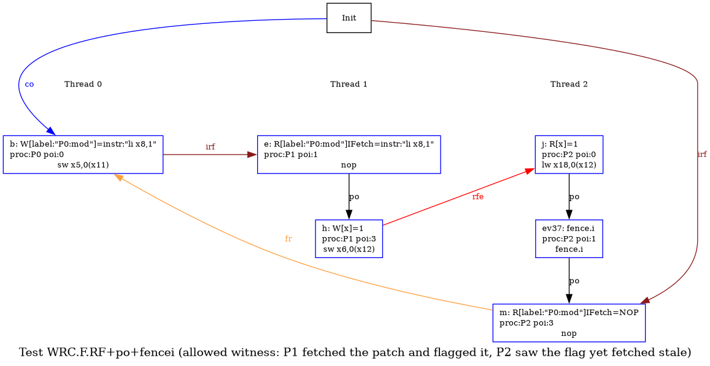
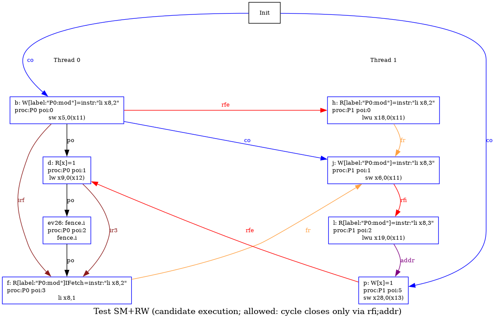
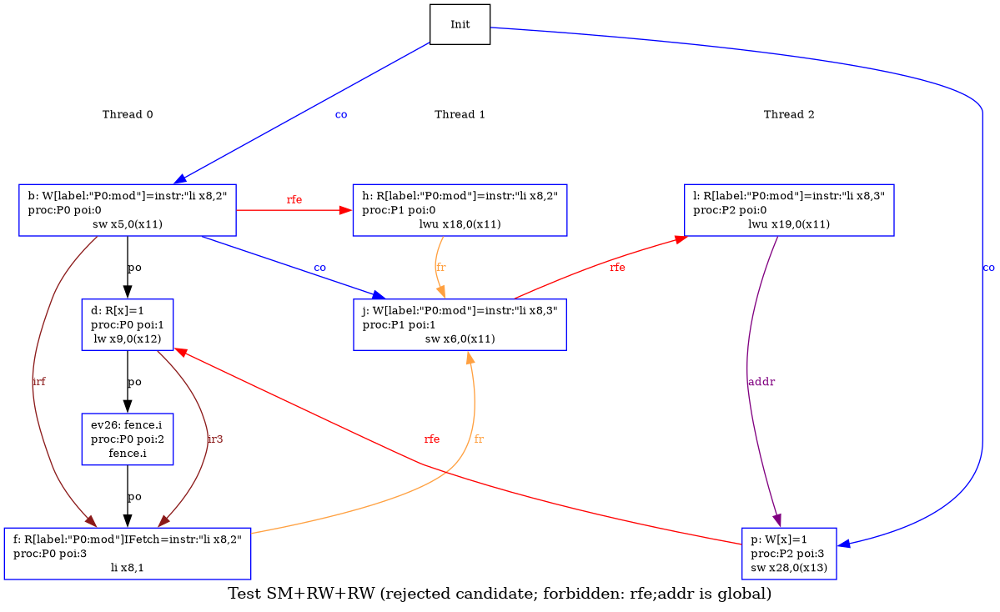

# litmus-tests-riscv-ifetch

RISC-V instruction-fetch litmus tests. For each test, the verdict
line says whether the outcome it looks for can occur (allowed) or
cannot (forbidden) under five model configurations:

- `Ziccif-only`: the base RISC-V memory model with instruction fetch. A
  fetch is ordered before all the decoded effects of the instruction it
  fetched, and `fence.i` orders a hart's earlier data accesses before
  its later fetches.

  ```
  ir1 = [I];(iico_data|iico_ctrl)+
  ir3 = [M & Exp];fencerel(Fence.i);[I]
  ```

- `Ziccid`: adds the Ziccid extension, which makes instruction fetch
  coherent with data. A hart's fetches occur in program order, and
  stores eventually become visible to instruction fetches without a
  `fence.i`.

  ```
  ir2 = [I];po;[I]
  ```

- `ir-decode-w` and `ir-decode` bracket an open question: how far
  must a fetch be ordered before the hart's own later execution?
  `ir-decode-w` is the weak end, ordering a fetch only before the
  hart's later explicit writes.

  ```
  ir_decode_w = [I];po;[Exp & W]
  ```

- `ir-decode`: the strong end, the assumption that a hart fully
  decodes in program order, so a fetch is ordered before all its
  later memory accesses.

  ```
  ir_decode = [I];po;[Exp | (anyW & NExp)]
  ```

- `ir3-fetch`: an alternative rule under discussion under which
  `fence.i` also orders a hart's earlier fetches, including the
  fetch of the `fence.i` itself, before its later fetches, not only
  its earlier data accesses.

  ```
  ir3f = [I];(po | (iico_data|iico_ctrl)+);[Fence.i];po;[I]
  ```

### ISA2.F+fence.w.w+fence.r.w+fencei

```
RISCV ISA2.F+fence.w.w+fence.r.w+fencei
Variant=self
{ 0:t0=instr:"li s2, 5"; 0:a1=P2:mod; 0:a2=y; 0:t1=1;
  1:a1=y; 1:a2=z; 1:t1=1;
  2:a1=z; }
P0           | P1           | P2           ;
sw t0,0(a1)  | lw s0,(a1)   | lw s1,(a1)   ;
fence w,w    | fence r,w    | fence.i      ;
sw t1,0(a2)  | sw t1,0(a2)  | mod:         ;
             |              | nop          ;
exists (1:s0=1 /\ 2:s1=1 /\ 2:s2=0)
```

An extended message-passing shape, with the flag relayed from the
writer through an intermediate hart to the hart that fetches the
patched code. The fences forbid the weak outcome even without
Ziccid, because the final hart's flag load sits before its
`fence.i` and gives it an access to order the fetch against.

`Ziccif-only` forbidden | `Ziccid` forbidden | `ir-decode-w` forbidden | `ir-decode` forbidden | `ir3-fetch` forbidden

> Without Fence.i this would be allowed, even with `Ziccid` as it only orders fetches and not explicit data loads. See ISA2.F+fence.w.w+fence.r.w+po.

### LB.FF

```
RISCV LB.FF
Variant=self
{ 0:t0=instr:"li s0, 2"; 0:a1=P1:mod1; 0:s0=0;
  1:t0=instr:"li s0, 2"; 1:a1=P0:mod0; 1:s0=0; }
P0           | P1           ;
mod0:        | mod1:        ;
li s0, 1     | li s0, 1     ;
sw t0,0(a1)  | sw t0,0(a1)  ;
exists (0:s0=2 /\ 1:s0=2)
```

The load-buffering shape with instruction fetches in place of the
usual data loads: each hart fetches its own site, then patches the
other hart's. Without Ziccid, out-of-order fetch permits the weak
outcome, where both fetches pick up the patch the other hart only
writes afterwards.

**`Ziccif-only` allowed !** | `Ziccid` forbidden | `ir-decode-w` forbidden | `ir-decode` forbidden | `ir3-fetch` allowed

> cf. CoFW

### MP+irf+fence.r.r

```
RISCV MP+irf+fence.r.r
(* adapted from Brendan's DIC.MP.WW+irf.litmus *)
Variant=self
{ 0:t0=instr:"li s0, 2"; 0:a1=P0:mod; 0:a2=x; 0:t1=1;
  1:a1=P0:mod; 1:a2=x; }
P0           | P1           ;
sw t0,0(a1)  | lw s1,(a2)   ;
mod:         | fence r,r    ;
li s0, 1     | lwu s2,0(a1)  ;
sw t1,0(a2)  |              ;
exists (0:s0=2 /\ 1:s1=1 /\ 1:s2=instr:"li s0, 1")
```

An MP shape with a basic flag, but the data location is an instruction the writer patches: executed on the writing thread it is up to date (`s0=2`), yet read as data on the reader thread after the flag it is outdated (`li s0, 1`). Any of the rules ordering a fetch before po-later instructions forbids this: Ziccid, `ir-decode-w`, and `ir-decode`. Otherwise out-of-order fetch allows it.

`Ziccif-only` allowed | `Ziccid` forbidden | `ir-decode-w` forbidden | `ir-decode` forbidden | `ir3-fetch` allowed

### WRC.F.RF+po+fencei

```
RISCV WRC.F.RF+po+fencei
(* adapted from Brendan's DIC.WRC-inst.litmus *)
Variant=self
{ 0:t0=instr:"li s0, 1"; 0:a1=P0:mod;
  1:a1=P0:mod; 1:a2=x; 1:t1=1; 1:s0=0;
  2:a1=P0:mod; 2:a2=x; 2:s0=0; }
P0           | P1          | P2          ;
sw t0,0(a1)  | jalr a1     | lw s2,(a2)  ;
j end        | sw t1,(a2)  | fence.i     ;
mod:         |             | jalr a1     ;
nop          |             |             ;
jr ra        |             |             ;
end:         |             |             ;
exists (1:s0=1 /\ 2:s2=1 /\ 2:s0=0)
```



A causality chain through instruction fetch: P1 fetches P0's patch (`1:s0=1`) and raises a flag; P2 reads the flag, `fence.i`s, yet still fetches the stale `nop` (`2:s0=0`). A fetch is not a coherent observer, so P1 seeing the patch does not make it global. The one discriminating link is P1's patch-fetch before its flag store: Ziccid's in-order fetch orders this, and the decode rules order it directly (fetch before po-later write), while Ziccif-only leaves it as plain po.

`Ziccif-only` allowed | `Ziccid` forbidden | `ir-decode-w` forbidden | `ir-decode` forbidden | `ir3-fetch` allowed

---

## Coherence per location

One code site: a hart's fetch against a later fetch, read, or store of the same address.

### CoFF+fencei

```
RISCV CoFF+fencei
Variant=self
{ 0:t0=instr:"li t6, 2"; 0:a1=P1:mod; }
P0           | P1                ;
sw t0,0(a1)  | jal mod           ;
             | mv s0, t6         ;
             | fence.i           ;
             | jal mod           ;
             | mv s1, t6         ;
             | j end             ;
             | mod:              ;
             | li t6, 1          ;
             | jr ra             ;
             | end:              ;
exists (1:s0=2 /\ 1:s1=1)
```

A hart fetches the same address twice, with a `fence.i` between the
two fetches. Without Ziccid a hart's instruction fetches need not
occur in program order, so the second fetch can return the old
instruction even after the first has already seen the patched one.
The `fence.i` does not prevent this: it orders a hart's earlier data
accesses ahead of its later fetches, not one fetch ahead of another.
The strengthened `ir3-fetch` rule does forbid it, ordering the earlier
fetch before the later one across the `fence.i`.

`Ziccif-only` allowed | `Ziccid` forbidden | `ir-decode-w` allowed | `ir-decode` allowed | `ir3-fetch` forbidden

#### CoFF (no Fence.i)

Only forbidden with `Ziccid`

### CoFF+load-fencei

```
RISCV CoFF+load-fencei
Variant=self
{ 0:t0=instr:"lw t6, 0(a3)"; 0:a1=P1:mod;
  1:a3=z; z=2; }
P0           | P1                ;
sw t0,0(a1)  | jal mod           ;
             | mv s0, t6         ;
             | fence.i           ;
             | jal mod           ;
             | mv s1, t6         ;
             | j end             ;
             | mod:              ;
             | li t6, 1          ;
             | jr ra             ;
             | end:              ;
exists (1:s0=2 /\ 1:s1=1)
```

The same setup as CoFF+fencei, but the refetched instruction is
patched from a load-immediate into a load from memory. The executed
load gives the `fence.i` an explicit access to order against, so the
two fetches can no longer happen out of order. CoFF+fencei, with its
register-only instruction, leaves the `fence.i` nothing to anchor.

`Ziccif-only` forbidden | `Ziccid` forbidden | `ir-decode-w` forbidden | `ir-decode` forbidden | `ir3-fetch` forbidden

### CoFR

```
RISCV CoFR
Variant=self
{ 0:t0=instr:"li t6, 2"; 0:a1=P1:mod;
  1:a2=P1:mod; }
P0           | P1                ;
sw t0,0(a1)  | mod:              ;
             | li t6, 1          ;
             | mv s0, t6         ;
             | lwu s1, 0(a2)      ;
exists (1:s0=2 /\ 1:s1=instr:"li t6, 1")
```

One hart fetches and runs the instruction at `mod`, then reads the
same address as data further down its program order, while another
hart patches `mod`. The candidate has the fetch execute the patched
`li t6, 2` while the later data load returns the original `li t6, 1`,
so the fetch and the read disagree about one location. The two decode
rules part ways here: `ir-decode` orders the fetch before every
po-later access and forbids it, `ir-decode-w` orders it before later
writes only and leaves this read open. `Ziccid` forbids it too, via
the data load's own fetch.

`Ziccif-only` allowed | `Ziccid` forbidden | `ir-decode-w` allowed | `ir-decode` forbidden | `ir3-fetch` allowed

> Should a fetch be ordered before a po-later data read of the same
> location? In-order decode says yes; the weak variant orders only
> later writes, so it lets the read overtake the fetch.

### CoFW

```
RISCV CoFW
(* adapted from Brendan's DIC.nobackwards.litmus *)
Variant=self
{ 0:t0=instr:"nop"; 0:a1=P0:mod; 0:t1=0; }
P0           ;
mod:         ;
li t1, 1     ;
sw t0,0(a1)  ;
exists 0:t1=0
```

A hart fetches an instruction, then overwrites the same address with
a store later in program order. Without Ziccid, out-of-order fetch is
permitted, so the fetch can observe that later store instead of the
instruction originally there.

**`Ziccif-only` allowed !** | `Ziccid` forbidden | `ir-decode-w` forbidden | `ir-decode` forbidden | `ir3-fetch` allowed

> This should not be allowed even without Ziccid. `ir-decode-w` and `ir-decode` both fix this.

## MP, fetch-to-execute

When does a fetch order a po-later access on the same hart?

### MP.FR+fence.w.w+po

```
RISCV MP.FR+fence.w.w+po
Variant=self
{ 0:t0=instr:"li x10, 1"; 0:a1=P1:mod; 0:a2=x; 0:t1=1; 1:a2=x; 1:x10=0; }
 P0          | P1          ;
 sw t1,0(a2) | mod: nop    ;
 fence w,w   | lw s1,(a2)  ;
 sw t0,0(a1) |             ;
exists (1:x10=1 /\ 1:s1=0)
```

An MP shape with a fetch used as the flag. Without Ziccid, out-of-order fetch allows this execution. Discriminates `ir-decode-w` from `ir-decode`: the former does not order the flag's fetch before the data read, the latter does.

`Ziccif-only` allowed | `Ziccid` forbidden | `ir-decode-w` allowed | `ir-decode` forbidden | `ir3-fetch` allowed

### MP.FR+fence.w.w+reg-addr

```
RISCV MP.FR+fence.w.w+reg-addr
(* adapted from Brendan's IDC.fetchtoexecutechained.litmus *)
Variant=self
{ 0:t2=1; 0:a3=z; 0:a1=P1:mod; 0:t0=instr:"mv a3, t1";
  1:a1=P1:mod; 1:a3=z; 1:t0=x; 1:t1=z; 1:s9=0;
  x=2; }
P0           | P1            ;
sw t2,0(a3)  | mod:          ;
fence w,w    |  mv a3, t0    ;
sw t0,0(a1)  |  lw s9, 0(a3) ;
exists (1:s9=0)
```

The fetched instruction's result feeds the address of a po-later load. Here that result comes from a register (`mv`), so the address dependency can be value-predicted and does not order the load after the fetch: the load still reads pre-patch data.

`Ziccif-only` allowed | `Ziccid` forbidden | `ir-decode-w` allowed | `ir-decode` forbidden | `ir3-fetch` allowed

### MP.FR+fence.w.w+load-addr

```
RISCV MP.FR+fence.w.w+load-addr
Variant=self
{ 0:t2=1; 0:a3=z; 0:a1=P1:mod; 0:t0=instr:"ld a3, 0(a4)";
  1:a1=P1:mod; 1:a4=pz; 1:a5=px; 1:s9=0;
  x=2; px=x; pz=z; }
P0           | P1            ;
sw t2,0(a3)  | mod:          ;
fence w,w    |  ld a3, 0(a5) ;
sw t0,0(a1)  |  lw s9, 0(a3) ;
exists (1:s9=0)
```

The same shape, but now the fetched instruction is a load, so the address dependency is rooted in a real memory event. That cannot be value-predicted: `ir1` anchors the fetch to the load, the addr dependency carries to the data load, and the stale read is forbidden in every model.

`Ziccif-only` forbidden | `Ziccid` forbidden | `ir-decode-w` forbidden | `ir-decode` forbidden | `ir3-fetch` forbidden

### MP.F+fence.w.w+patched-load

```
RISCV MP.F+fence.w.w+patched-load
(* adapted from Brendan's DIC.fetchtoexecute.litmus *)
Variant=self
{ 0:t0=instr:"lw s0, 0(a2)"; 0:a1=P1:mod; 0:a2=z; 0:t1=1;
  1:a2=z; 1:s0=0; }
P0           | P1           ;
sw t1,0(a2)  | mod:         ;
fence w,w    | li s0, 2     ;
sw t0,0(a1)  |              ;
exists (1:s0=0)
```

An MP shape whose two reads on the reader are the implicit
instruction fetch and the explicit data load the fetched
instruction performs. The flag is the patched instruction itself, a
load of z, and the message passed is the writer's store to z. `ir1`
orders the fetch before that load, so the writer's fence is enough
to forbid the weak outcome, without fence.i or Ziccid.

`Ziccif-only` forbidden | `Ziccid` forbidden | `ir-decode-w` forbidden | `ir-decode` forbidden | `ir3-fetch` forbidden

## MP, write then fetch

Publish freshly written code, then have a remote hart consume it. Consuming the publication does not make that hart's fetch see the new code; only its own `fence.i` would.

### MP.RF+fence.w.w+ctrl-jr

```
RISCV MP.RF+fence.w.w+ctrl-jr
(* adapted from Brendan's DIC.miniJit01.litmus *)
Variant=self
{ [x]=P1:end;
  0:t0=instr:"li s0, 3"; 0:a1=P1:new; 0:a2=x;
  1:a2=x; 1:s0=0; }
P0           | P1           ;
sw t0,0(a1)  | ld s1,(a2)   ;
fence w,w    | jr s1        ;
sd a1,0(a2)  | new:         ;
             | li s0, 2     ;
             | end:         ;
exists (1:s0=2)
```

An MP shape where P0 writes an instruction as data at the `new` label, then as the flag writes the `new` label itself. The reader loads the label and `jr`s through it, so the flag induces a control dependency into the fetch at `new`. This is permitted in all models, including Ziccid: no model orders the fetch behind that dependency, so the new label is consumed yet stale bytes are fetched.

`Ziccif-only` allowed | `Ziccid` allowed | `ir-decode-w` allowed | `ir-decode` allowed | `ir3-fetch` allowed

### MP.RF+fencei-fence.w.w+fence.r.r

```
RISCV MP.RF+fencei-fence.w.w+fence.r.r
Variant=self
{ 0:t0=instr:"lw s0, 0(a4)"; 0:a1=P1:mod; 0:a2=f; 0:t1=1;
  1:a2=f; 1:a3=x; 1:a4=y; 1:s0=0;
  x=1; y=2; }
P0           | P1            ;
sw t0,0(a1)  | lw s1,0(a2)   ;
fence.i      | fence r,r     ;
fence w,w    | mod:          ;
sw t1,0(a2)  | lw s0,0(a3)   ;
exists (1:s1=1 /\ 1:s0=1)
```

An MP shape where the data is an instruction the reader fetches. In a regular data MP, the barriers here (writer `fence w,w`, reader `fence r,r`) would suffice to forbid the stale read. Here they do not, and in particular the writer's `fence.i` has no impact on another thread: the reader still fetches the stale `mod`. Allowed in all models.

`Ziccif-only` allowed | `Ziccid` allowed | `ir-decode-w` allowed | `ir-decode` allowed | `ir3-fetch` allowed

## fence.i as a data fence

No self-modification. `fence.i` still orders ordinary data accesses (R-R, W-W).

### MP+fence.w.w+fencei

```
RISCV MP+fence.w.w+fencei
(* adapted from Brendan's DIC.fenceiMP.litmus *)
Variant=self
{ 0:a1=x; 0:a2=y; 0:t1=1; 1:a1=x; 1:a2=y; }
P0           | P1           ;
sw t1,0(a1)  | lw s0,(a2)   ;
fence w,w    | fence.i      ;
sw t1,0(a2)  | lw s1,(a1)   ;
exists (1:s0=1 /\ 1:s1=0)
```

Plain message passing with no self-modified code. The reader's
`fence.i` orders its earlier load ahead of the fetch of the later
one, and that fetch is ordered before its own load, so the two
reads cannot reorder in any configuration. Here `fence.i` acts as a
read-read barrier.

`Ziccif-only` forbidden | `Ziccid` forbidden | `ir-decode-w` forbidden | `ir-decode` forbidden | `ir3-fetch` forbidden

### MP+fencei+fence.r.r

```
RISCV MP+fencei+fence.r.r
Variant=self
{ 0:a1=x; 0:a2=y; 0:t1=1; 1:a1=x; 1:a2=y; }
P0           | P1           ;
sw t1,0(a1)  | lw s0,(a2)   ;
fence.i      | fence r,r    ;
sw t1,0(a2)  | lw s1,(a1)   ;
exists (1:s0=1 /\ 1:s1=0)
```

The writer-side counterpart of MP+fence.w.w+fencei: the `fence.i`
now sits between the writer's two stores. It orders the earlier
store ahead of the fetch of the later store's instruction, and a
fetch is ordered before the store that instruction performs, so the
two stores cannot reorder. The `fence.i` acts as a write-write
barrier here, and with the reader's `fence r,r` the weak outcome is
forbidden in every configuration.

`Ziccif-only` forbidden | `Ziccid` forbidden | `ir-decode-w` forbidden | `ir-decode` forbidden | `ir3-fetch` forbidden

## Store buffering with a fetch

A store-buffering shape with one arm replaced by instruction fetch.

### SB.F+addr+fence.rw.rw

```
RISCV SB.F+addr+fence.rw.rw
(* adapted from Brendan's DIC.emailQ2.litmus *)
Variant=self
{ 0:t0=instr:"mv a1, a2"; 0:a0=P0:mod; 0:a1=y; 0:a2=x;
  1:a0=P0:mod; 1:a1=x; 1:t1=1; }
P0           | P1           ;
sw t0,0(a0)  | sw t1,0(a1)  ;
mod:         | fence rw,rw  ;
nop          | lwu s1,0(a0) ;
lwu s0,0(a1) |              ;
exists (0:a1=x /\ 0:s0=0 /\ 1:s1=instr:"nop")
```

A store-buffering shape where P1 is a regular SB participant (store `x`, `fence rw,rw`, read `mod`), and P0 patches its own po-later instruction, sitting before P0's read, with an address dependency into it. The patch rewrites `mod` from `nop` to `mv a1, a2`, redirecting `a1`, the address P0 then reads, from `y` to `x`. Using the value the patched instruction produced does not order the patch store before that read: P0 reads `x` stale (`s0=0`) while P1's data read of `mod` still sees the old `nop`, the SB outcome. Where fetches are ordered before po-later reads this is forbidden (Ziccid and `ir-decode`); otherwise it is allowed.

`Ziccif-only` allowed | `Ziccid` forbidden | `ir-decode-w` allowed | `ir-decode` forbidden | `ir3-fetch` allowed

### SB.RF+fence.w.r+po

```
RISCV SB.RF+fence.w.r+po
Variant=self
{ 0:t0=instr:"li s0, 2"; 0:a1=P1:mod; 0:a2=x;
  1:a2=x; 1:t1=1; 1:s0=0; }
P0           | P1           ;
sw t0,0(a1)  | sw t1,0(a2)  ;
fence w,r    | mod:         ;
lw s1,(a2)   | li s0, 1     ;
exists (0:s1=0 /\ 1:s0=1)
```

An SB shape where P0's store patches an instruction that P1 fetches in place of its load. P0 patches `mod`, `fence w,r`, then reads `x`; P1 stores `x`, then fetches `mod`. The candidate has both sides stale: P0 reads `x=0` and P1 fetches the old `mod` (`s0=1`). Allowed in all models: nothing, not even Ziccid, orders a hart's store before its own po-later fetch. A `fence.i` on P1 forbids it, ordering that store before the fetch.

`Ziccif-only` allowed | `Ziccid` allowed | `ir-decode-w` allowed | `ir-decode` allowed | `ir3-fetch` allowed

## Multi-writer self-modify

### SM+RW

```
RISCV SM+RW
Variant=self
{ 0:t0=instr:"li s0, 2"; 0:a1=P0:mod; 0:a2=x;
  1:t1=instr:"li s0, 3"; 1:a1=P0:mod; 1:a2=x; 1:t3=1; }
P0           | P1               ;
sw t0,0(a1)  | lwu s2,0(a1)      ;
lw s1,(a2)   | sw t1,0(a1)      ;
fence.i      | lwu s3,0(a1)      ;
mod:         | xor t2,s3,s3     ;
li s0, 1     | add a3,a2,t2     ;
             | sw t3,0(a3)      ;
exists (0:s1=1 /\ 1:s2=instr:"li s0, 2" /\ 1:s3=instr:"li s0, 3" /\ 0:s0=2)
```



P0 writes the instruction at `mod`, which P1 observes and then overwrites. After re-reading its own overwrite, P1 writes a flag through an address dependency. P0 reads the flag, `fence.i`s, and fetches `mod`, which is still P0's own initial write. This is allowed in all models: P1's re-read can be forwarded from its store buffer (`rfi`) rather than reading the overwrite globally, so the overwrite need not propagate, and the address-dependent flag can be set without it. The forwarding link `rfi;addr` is not a global edge, so the cycle stays open.

`Ziccif-only` allowed | `Ziccid` allowed | `ir-decode-w` allowed | `ir-decode` allowed | `ir3-fetch` allowed

### SM+RW+RW

```
RISCV SM+RW+RW
Variant=self
{ 0:t0=instr:"li s0, 2"; 0:a1=P0:mod; 0:a2=x;
  1:t1=instr:"li s0, 3"; 1:a1=P0:mod;
  2:a1=P0:mod; 2:a2=x; 2:t3=1; }
P0           | P1           | P2               ;
sw t0,0(a1)  | lwu s2,0(a1)  | lwu s3,0(a1)      ;
lw s1,(a2)   | sw t1,0(a1)  | xor t2,s3,s3     ;
fence.i      |              | add a3,a2,t2     ;
mod:         |              | sw t3,0(a3)      ;
li s0, 1     |              |                  ;
exists (0:s1=1 /\ 1:s2=instr:"li s0, 2" /\ 2:s3=instr:"li s0, 3" /\ 0:s0=2)
```



P1's observe-overwrite-republish role from SM+RW is split here: P1 overwrites, but P2 does the re-read and the address-dependent flag write. With the re-read on a separate hart there is no store buffer to forward from, so it reads P1's overwrite globally (`rfe`) and the flag is ordered after it (`rfe;addr`). P0 seeing the flag then implies the overwrite is visible to its fetch, so it is forbidden in all models. This witnesses multi-copy atomicity of instruction writes: a store observed by one hart through the memory system is observed by all.

`Ziccif-only` forbidden | `Ziccid` forbidden | `ir-decode-w` forbidden | `ir-decode` forbidden | `ir3-fetch` forbidden

## MP.FF with a patched jump as flag

P0 publishes freshly-patched code by patching P1's `entry` jump to land in it. P1 sees the publication only by fetching that jump, so the flag is itself a fetch; the candidate takes the new jump yet fetches a stale `target`. Variants differ in what sits between the two fetches: nothing, a `fence.i`, or a `fence.i` anchored by an explicit access.

### MP.FF+jump

```
RISCV MP.FF+jump
(* adapted from Brendan's DIC.miniJit03.litmus *)
Variant=self
{ 0:a0=P1:target; 0:t0=instr:"li s0, 3";
  0:a1=P1:entry;  0:t1=instr:"j target";
  1:s0=0; }
P0           | P1           ;
sw t0,0(a0)  | entry:       ;
fence w,w    |  j end       ;
sw t1,0(a1)  | target:      ;
             |  li s0, 2    ;
             | end:         ;
exists (1:s0=2)
```

MP shape with the flag itself a fetch. Out-of-order fetch allows the weak execution in every tier but Ziccid.

`Ziccif-only` allowed | `Ziccid` forbidden | `ir-decode-w` allowed | `ir-decode` allowed | `ir3-fetch` allowed

### MP.FF+jump-fencei

```
RISCV MP.FF+jump-fencei
(* adapted from Brendan's IDC.miniJit03+fencei.litmus *)
Variant=self
{ 0:a0=P1:target; 0:t0=instr:"li s0, 3";
  0:a1=P1:entry;  0:t1=instr:"j fi";
  1:s0=0; }
P0           | P1           ;
sw t0,0(a0)  | entry:       ;
fence w,w    |  j end       ;
sw t1,0(a1)  | fi:          ;
             |  fence.i     ;
             | target:      ;
             |  li s0, 2    ;
             | end:         ;
exists (1:s0=2)
```

A `fence.i` at the jump target does not close it: the patched code is a load-immediate, not an explicit memory event, so the `fence.i` has nothing to anchor. Still allowed outside Ziccid and the corrected `ir3-fetch`, which closes it instead by ordering the `fence.i`'s own fetch before the later fetch.

`Ziccif-only` allowed | `Ziccid` forbidden | `ir-decode-w` allowed | `ir-decode` allowed | `ir3-fetch` forbidden

### MP.FF+jump-load-fencei

```
RISCV MP.FF+jump-load-fencei
Variant=self
{ 0:a0=P1:target; 0:t0=instr:"li s0, 3";
  0:a1=P1:entry;  0:t1=instr:"j fi";
  1:a4=z; z=2; }
P0           | P1            ;
sw t0,0(a0)  | entry:        ;
fence w,w    |  j end        ;
sw t1,0(a1)  | fi:           ;
             |  lw s7,0(a4)  ;
             |  fence.i      ;
             | target:       ;
             |  li s0, 2     ;
             | end:          ;
exists (1:s0=2)
```

The same idiom with a load fetched before the `fence.i`. The load anchors the `fence.i`, but the flag is the register-only entry jump, so Ziccif-only has no edge from the flag fetch to the load and stays allowed. In-order decode supplies that edge and closes it; `ir-decode-w` does not, as the anchor is a read, not a write.

`Ziccif-only` allowed | `Ziccid` forbidden | `ir-decode-w` allowed | `ir-decode` forbidden | `ir3-fetch` forbidden

### MP.FF+jump-store-fencei

```
RISCV MP.FF+jump-store-fencei
Variant=self
{ 0:a0=P1:target; 0:t0=instr:"li s0, 3";
  0:a1=P1:entry;  0:t1=instr:"j fi";
  1:a4=z; 1:s7=5; }
P0           | P1            ;
sw t0,0(a0)  | entry:        ;
fence w,w    |  j end        ;
sw t1,0(a1)  | fi:           ;
             |  sw s7,0(a4)  ;
             |  fence.i      ;
             | target:       ;
             |  li s0, 2     ;
             | end:          ;
exists (1:s0=2)
```

As the load variant, but the anchor is a store. `ir-decode-w` now closes it too: its fetch-before-later-writes edge reaches the store. Default still allows (the flag is the jump). The load/store pair pins the `ir-decode-w` vs `ir-decode` boundary.

`Ziccif-only` allowed | `Ziccid` forbidden | `ir-decode-w` forbidden | `ir-decode` forbidden | `ir3-fetch` forbidden

## MP with a patched fence as flag

Two MP-shape tests where the patched-in, fetched instruction is itself a
fence: a `fence r,r` (which here orders nothing) and a `fence.i` (which
orders later fetches).

### MP.FR+patched-fence.r.r

```
RISCV MP.FR+patched-fence.r.r
Variant=self
{ 0:t0=1; 0:t1=instr:"fence r,r";
  0:a1=z; 0:a2=P1:frr_slot;
  1:a1=z;
  1:s8=0; 1:s9=0; }
P0           | P1           ;
sw t0,0(a1)  | frr_slot:    ;
fence w,w    |  li s8, 1    ;
sw t1,0(a2)  |  lw s9,(a1)  ;
exists (1:s8=0 /\ 1:s9=0)
```

P0 writes z, then patches P1's `frr_slot` from `li s8, 1` into `fence r,r`
(so `s8=0` witnesses the fetch saw the fence). The fetched fence has no
po-earlier read to order against, so it orders nothing and the later read
of z is still stale. A lightweight fence is right here; a heavyweight
barrier whose later instructions had to await its commit would forbid it.

`Ziccif-only` allowed | `Ziccid` forbidden | `ir-decode-w` allowed | `ir-decode` forbidden | `ir3-fetch` allowed

### MP.FF+patched-fence.i

```
RISCV MP.FF+patched-fence.i
Variant=self
{ 0:t0=instr:"li s9, 1"; 0:t1=instr:"fence.i";
  0:a1=P1:mod; 0:a2=P1:fi_slot;
  1:s8=0; 1:s9=0; }
P0           | P1           ;
sw t0,0(a1)  | fi_slot:     ;
fence w,w    |  j end       ;
sw t1,0(a2)  |  li s8, 1    ;
             | mod:         ;
             |  nop         ;
             | end:         ;
exists (1:s8=1 /\ 1:s9=0)
```

The flag is a fetched `fence.i` and the data is another fetch. This
should probably still order with no preceding explicit memory access.
The `fence.i` should also order subsequent fetches after its own fetch
(cf. `ir3-fetch`).

`Ziccif-only` allowed | `Ziccid` forbidden | `ir-decode-w` allowed | `ir-decode` allowed | `ir3-fetch` forbidden
